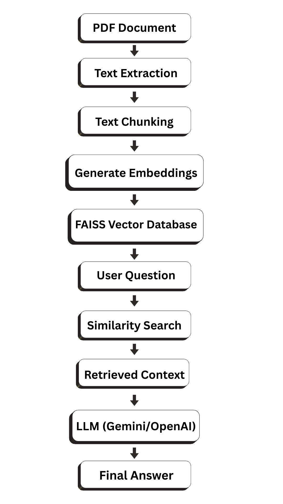
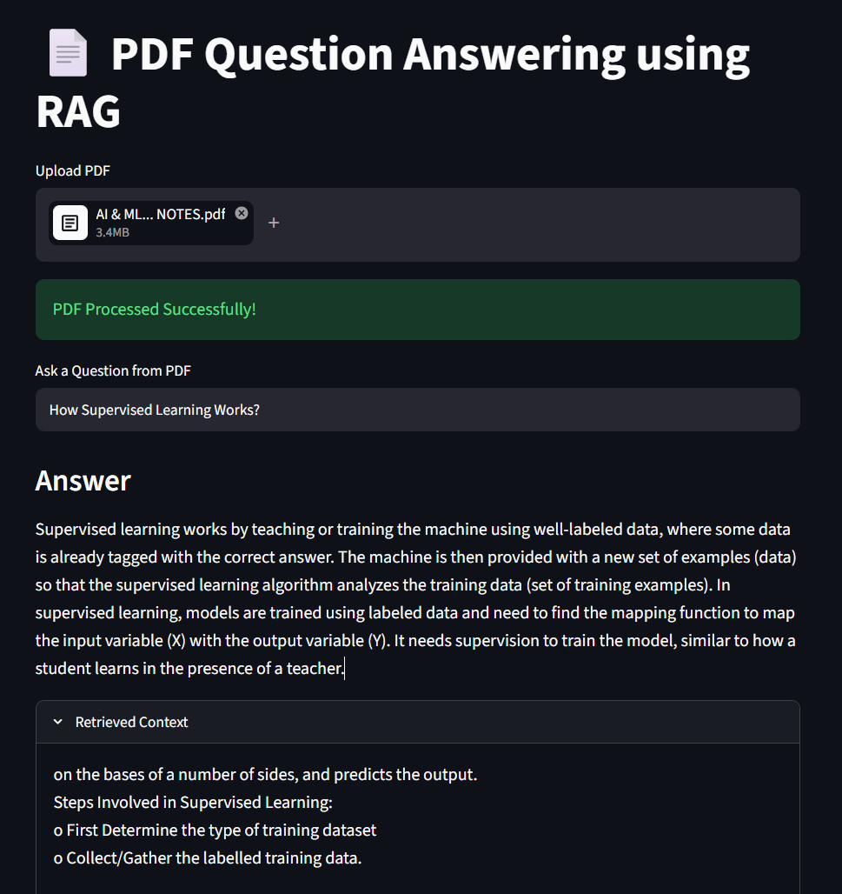

# 📄 PDF Chatbot Using RAG

## Overview

PDF Chatbot Using RAG is a Generative AI project that allows users to upload PDF documents and ask questions about their content. The system uses Retrieval-Augmented Generation (RAG) to retrieve relevant information from the uploaded document and generate accurate answers using Google's Gemini AI model.

This project demonstrates the practical implementation of PDF processing, semantic search, vector databases, embeddings, and Large Language Models (LLMs).

---

## Features

* Upload PDF documents
* Extract text from PDF files
* Split text into meaningful chunks
* Generate embeddings using Sentence Transformers
* Store embeddings in FAISS Vector Database
* Retrieve relevant document context
* Answer questions using Google Gemini AI
* Interactive Streamlit Web Interface
* Display retrieved context for transparency

---

## Technologies Used

* Python
* Streamlit
* Google Gemini AI
* Sentence Transformers
* FAISS
* PyPDF2
* NumPy

---

## System Architecture



---

## Workflow

1. User uploads a PDF document.
2. Text is extracted from the PDF.
3. Extracted text is divided into smaller chunks.
4. Sentence Transformer generates embeddings for each chunk.
5. Embeddings are stored in a FAISS vector database.
6. User asks a question related to the document.
7. The system retrieves the most relevant chunks using similarity search.
8. Retrieved context is sent to Gemini AI.
9. Gemini generates an accurate answer based on the retrieved content.
10. The answer is displayed to the user.

---

## Output Screenshot



---

## Project Structure

```text
PDF-Chatbot-Using-RAG
│
├── app.py
├── requirements.txt
├── Architecture.png
├── Output.png
├── Sample.pdf
└── README.md
```

---

## Installation

Clone the repository:

```bash
git clone https://github.com/Anbuselvan-04/PDF-Chatbot-Using-RAG.git
```

Navigate to the project directory:

```bash
cd PDF-Chatbot-Using-RAG
```

Install required packages:

```bash
pip install -r requirements.txt
```

---

## Run the Application

```bash
streamlit run app.py
```

After running the command, open the local Streamlit URL in your browser.

---

## Sample Usage

1. Upload a PDF file.
2. Wait for the PDF to be processed.
3. Enter a question related to the document.
4. View the generated answer.
5. Expand the Retrieved Context section to see supporting information.

---

## Applications

* Educational Document Assistant
* Research Paper Analysis
* Enterprise Knowledge Management
* Intelligent PDF Search
* AI-Powered Document Chatbot
* Digital Library Assistant

---

## Future Enhancements

* Multi-PDF Support
* Chat History
* Voice-Based Question Answering
* Advanced RAG Techniques
* Cloud Deployment
* Support for DOCX and TXT Files

---

## Requirements

Main Libraries Used:

* streamlit
* google-generativeai
* PyPDF2
* sentence-transformers
* faiss-cpu
* numpy

Install all dependencies using:

```bash
pip install -r requirements.txt
```

---

## Author

**Anbuselvan**

AI & Machine Learning Enthusiast

---

## License

This project is developed for educational and learning purposes.
# PDF-Chatbot-Using-RAG
A Retrieval-Augmented Generation (RAG) based PDF Question Answering System that extracts text from PDF documents, generates embeddings using Sentence Transformers, stores them in a FAISS vector database, retrieves relevant context, and generates accurate answers using Google's Gemini AI model.
